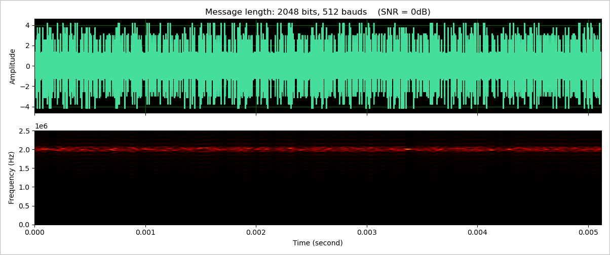

# DSPCourseCodes

Codes for DSP course's final assignment.

## Simulation 1: PseudoRNG

Run `pseudo_rng.py`.


## Simulation 2: DTMF Simulation

Run `dtmf_dial.py`.


## Simulation 3: 16-QAM Simulation

Run `16_qam.py`.





## License

This code is released under the Apache-2.0 License.
```text
Copyright (C) 2020
Xintao Hu <hxt.taoge@gmail.com>
```
